# 🍹 Cocktail Lab

> 다양한 칵테일 정보를 검색하고 탐색할 수 있는 서비스

<br />

## 📌 목차

- [프로젝트 소개](#-프로젝트-소개)
- [기술 스택](#-기술-스택)
- [주요 기능](#-주요-기능)
- [실행 방법](#-실행-방법)
- [폴더 구조](#-폴더-구조)
- [커밋 컨벤션](#-커밋-컨벤션)
- [스크린샷](#-스크린샷)
- [데이터 출처](#-데이터-출처)

<br />

## 🍸 프로젝트 소개

**Cocktail Lab**은 칵테일을 좋아하는 누구나 손쉽게 칵테일 정보를 찾을 수 있는 서비스입니다.  
칵테일 이름, 카테고리, 재료 기반으로 원하는 칵테일을 검색하고 상세 정보를 확인할 수 있습니다.

- **배포 URL** : [https://cocktail-recipes-liard.vercel.app](https://cocktail-recipes-liard.vercel.app)

<br />

## 🛠 기술 스택

### Frontend


| 분류 | 기술 |
|---|---|
| **언어** | TypeScript |
| **프레임워크** | React 18 |
| **빌드 도구** | Vite |
| **상태 관리** | Zustand |
| **서버 상태** | TanStack Query (React Query v5) |
| **UI 라이브러리** | MUI (Material UI v7) |
| **스타일링** | styled-components, Emotion |
| **다국어** | i18next, react-i18next |
| **배포** | Vercel |

<br />

## ✨ 주요 기능

### 🔍 칵테일 검색 및 필터링
- 칵테일 이름으로 검색
- 카테고리별 필터링 (Shot, Cocktail, Beer 등)

### 📋 칵테일 상세 정보
- 칵테일 이미지, 이름, 카테고리 확인
- 재료 및 레시피 확인
- 제조 방법 안내

### 🌿 재료 탐색 (필터 & 정렬)
- 재료 이름으로 검색
- 재료 필터링 및 정렬 기능 (이름순, 카테고리별 등)

### 📋 재료 상세 정보
- 재료 이미지, 이름 확인
- 카테고리 및 정보 확인
- 관련 칵테일 목록 확인

### 📱 반응형 UI
- 모바일 / 데스크탑 화면 크기에 최적화된 레이아웃

### 🌐 다국어 지원
- 재료 및 일부 칵테일 영문 번역 (i18next)

### ⚙️ CI/CD
- GitHub Actions를 통한 자동 린트 및 테스트 실행
- Vercel 자동 배포 연동

<br />

## 🚀 실행 방법

### 요구 사항

- Node.js 18 이상
- npm 또는 yarn

### 설치 및 실행

```bash
# 저장소 클론
git clone https://github.com/DT-HYUNJUN/cocktail-lab.git
cd cocktail-lab

# 패키지 설치
npm install

# 개발 서버 실행
npm run dev
```

### 빌드

```bash
# 프로덕션 빌드
npm run build

# 빌드 결과물 미리보기
npm run preview
```

### 기타 명령어

```bash
# 린트 검사
npm run lint
```

<br />

## 📁 폴더 구조

```
cocktail-lab/
├── .github/
│   └── workflows/            # GitHub Actions CI/CD
├── .vercel/                  # GutHub Actions CI/CD용 vercel 토큰
├── readme/                   # README 이미지 리소스
├── src/
│   ├── app/                  # 앱 전체 초기화 및 설정
│   │   └── layouts/
│   ├── pages/                # 각 라우트에 대응하는 페이지 컴포넌트
│   │   ├── home/
│   │   ├── cocktail/
│   │   ├── cocktailDetail/
│   │   ├── ingredient/
│   │   ├── ingredientDetail/
│   │   └── search/
│   ├── widgets/              # 여러 entities/features를 조합한 독립적인 UI 블록
│   ├── entities/             # 비즈니스 도메인 단위 모듈 (칵테일, 재료 등)
│   │   ├── cocktail/
│   │   └── ingredient/
│   └── shared/               # 어디서든 재사용 가능한 공통 코드
│       ├── api/
│       ├── assets/
│       ├── color/
│       ├── i18n/
│       ├── theme/
│       ├── ui/
│       └── utils/
├── index.html
├── package.json
├── tsconfig.json
└── vite.config.ts
```

<br />

## 📝 커밋 컨벤션

```
feat     : 새로운 기능 추가
fix      : 버그 수정
style    : 코드 포맷팅, 세미콜론 누락 등
refactor : 코드 리팩토링
chore    : 빌드 설정, 패키지 업데이트 등
docs     : 문서 수정
```

<br />

## 📸 스크린샷

|홈|
|--|
|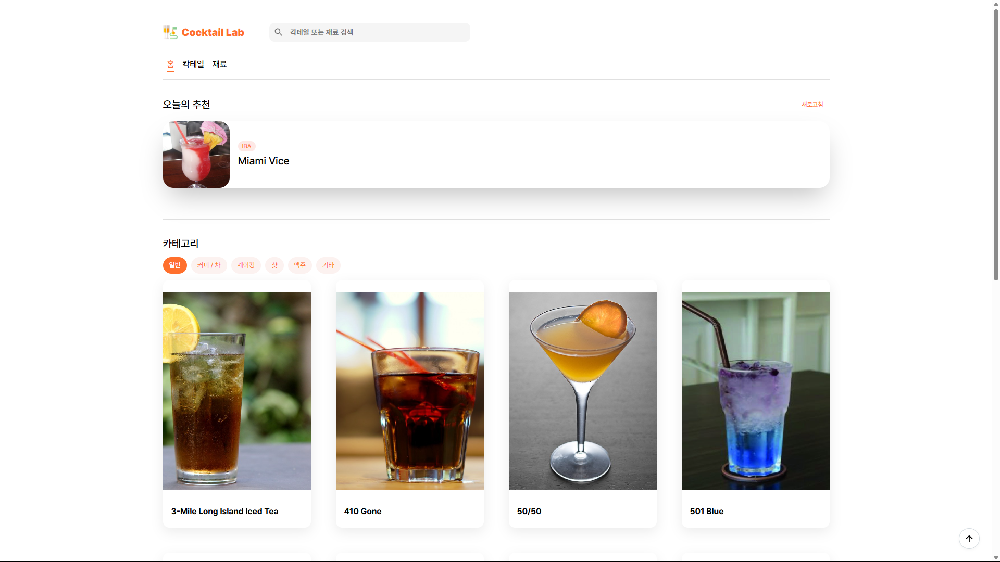|

|칵테일|
|--|
|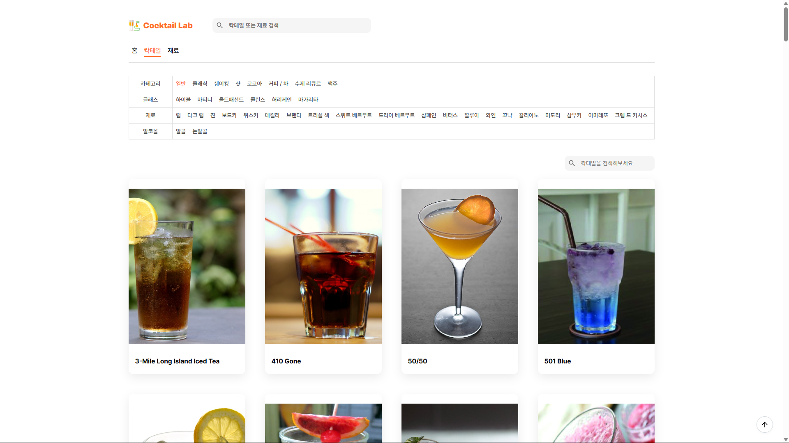|
|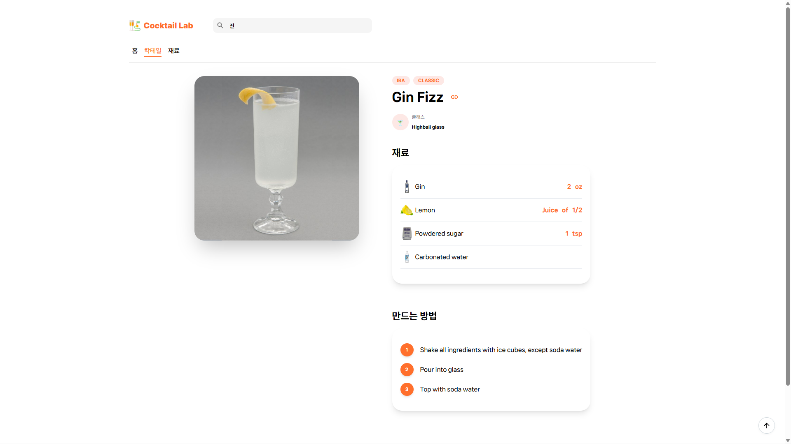|


|재료|
|--|
|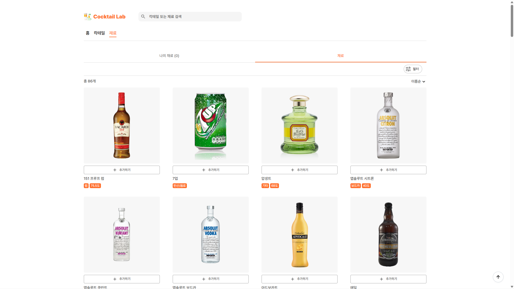|
|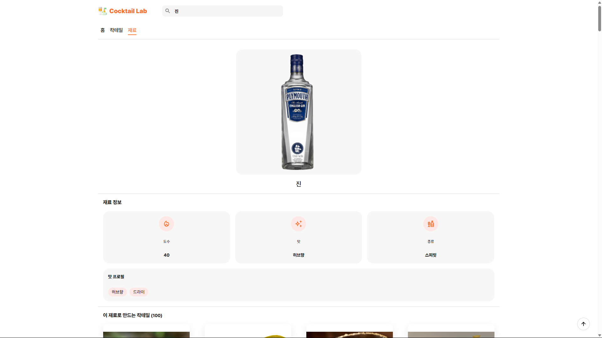|
||

|검색|
|--|
|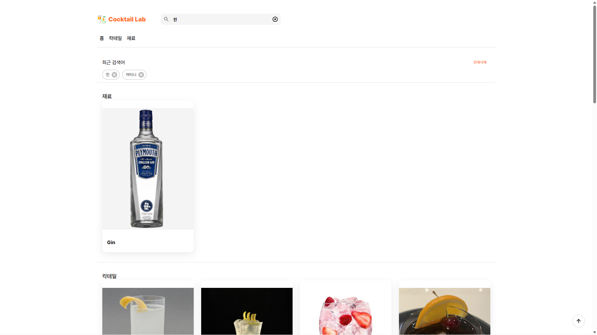|


### 📱 모바일 환경
|홈|
|--|
|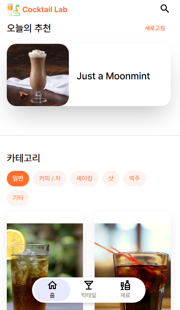|

|칵테일|세부정보|
|--|--|
|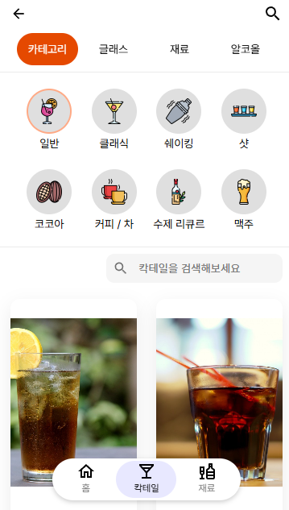|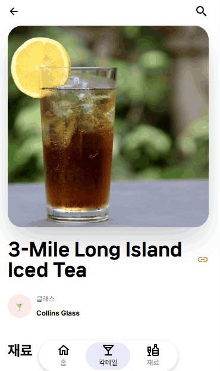|

|재료|세부정보|필터|
|--|--|--|
|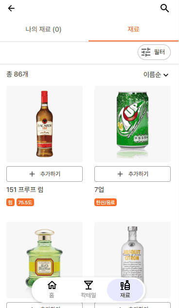|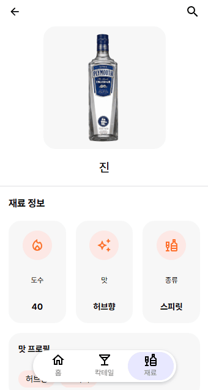|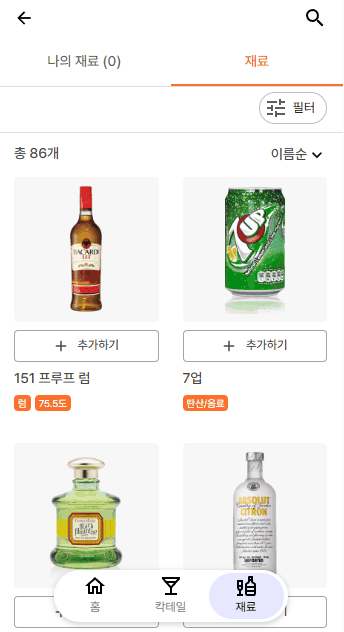|

|검색|
|--|
|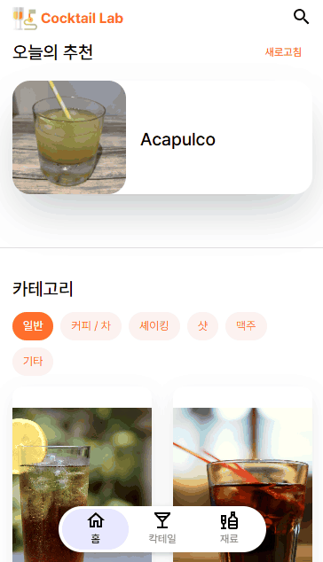|

<br />

## 데이터 출처

본 서비스는 **[TheCocktailDB](https://www.thecocktaildb.com/)** 의 무료 공개 API를 사용하여 칵테일 데이터를 제공합니다.

| 항목 | 내용 |
|---|---|
| **API** | TheCocktailDB API |
| **URL** | https://www.thecocktaildb.com/api.php | 